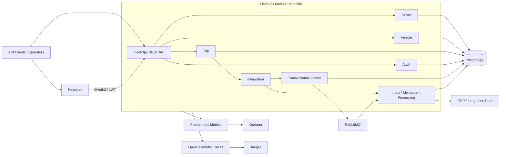

# FleetOps Enterprise Platform

[](https://github.com/aalsaeed/fleetops-enterprise-platform/actions/workflows/ci.yml)


**FleetOps is a production-oriented fleet operations and ERP integration reference platform built to demonstrate enterprise backend engineering.**

It combines explicit domain boundaries, reliable asynchronous integration, centralized identity and RBAC, immutable auditability, operational observability, optimistic concurrency control, and reproducible containerized deployment in one runnable system.

> **Portfolio status:** the core platform is complete. The repository now includes an architecture case study, runtime demo path, presentation narrative, and technical interview guide; the remaining portfolio enhancement is curated runtime evidence imagery.

## Why This Project Matters

Fleet software becomes technically difficult when trip state, drivers, vehicles, external ERP workflows, retries, duplicate messages, authorization, auditability, and production diagnostics must remain consistent together.

FleetOps is intentionally built around those engineering problems instead of around CRUD screens alone:

- business rules stay inside explicit domain modules;
- ERP handoffs use transactional outbox/inbox patterns instead of fragile dual writes;
- RabbitMQ delivery is backed by idempotency, retry/recovery, and dead-letter handling;
- Keycloak-backed OAuth2/JWT authorization protects APIs by role;
- immutable audit records and HTTP correlation provide traceability;
- Prometheus, Grafana, OpenTelemetry, and Jaeger expose operational behavior;
- optimistic concurrency prevents silent lost updates;
- Docker Compose reproduces the complete local topology;
- GitHub Actions verifies tests, the OCI image, non-root execution, Compose configuration, and application readiness.

## Architecture at a Glance



The application is deliberately a **modular monolith**: it keeps deployment simple while enforcing business boundaries that can be extracted later only when independent scaling or deployment is justified.

## Engineering Highlights

| Engineering concern | Implementation |
| --- | --- |
| Domain architecture | Separate Driver, Vehicle, Trip, Integration, Audit, Common, and Bootstrap modules with inward dependencies |
| Reliable ERP integration | Transactional outbox, inbox/idempotency, retry scheduling, recovery operations, RabbitMQ, and dead-letter handling |
| Security | Spring Security OAuth2 Resource Server, JWT authority mapping, Keycloak, and role-based API policies |
| Auditability | Immutable audit trail, HTTP audit capture, correlation identifiers, and admin audit query API |
| Observability | Spring Boot Actuator, Prometheus metrics, provisioned Grafana dashboard, OpenTelemetry tracing, and Jaeger |
| Concurrency | Aggregate revisions, optimistic locking, and provider-neutral conflict responses |
| Database evolution | PostgreSQL with Flyway migrations |
| Runtime packaging | Hardened OCI image running as non-root UID/GID `10001:10001` |
| Local deployment | Full Docker Compose topology for application, PostgreSQL, RabbitMQ, Redis, Keycloak, Prometheus, Grafana, and Jaeger |
| CI | Maven verification, container build, non-root check, Compose validation, and readiness smoke test |

## Core Business Capabilities

### Driver

Driver creation, retrieval, lifecycle/status transitions, persistence, API validation, authorization, auditing, and concurrency protection.

### Vehicle

Vehicle creation, lifecycle/status transitions, typed vehicle data, persistence, API validation, authorization, auditing, and concurrency protection.

### Trip

Trip creation and lifecycle management, driver/vehicle assignment, resource validation, domain transition rules, persistence, and ERP shipment handoff.

### ERP Integration

Reliable asynchronous shipment processing with transactional outbox/inbox persistence, RabbitMQ publishing and consumption, idempotency, retry/backoff, recovery, dead-letter handling, and operational reconciliation APIs.

## Technology Stack

- **Java 21**
- **Spring Boot 4.1**
- **Maven** multi-module build
- **PostgreSQL 17** + **Flyway**
- **RabbitMQ 4**
- **Redis 8**
- **Keycloak 26**
- **Spring Security OAuth2 Resource Server**
- **Micrometer / Prometheus**
- **Grafana**
- **OpenTelemetry** + **Jaeger**
- **JUnit 5** + **Testcontainers**
- **Docker / Docker Compose**
- **GitHub Actions**

## Repository Structure

| Module | Responsibility |
| --- | --- |
| `fleetops-common` | Shared technical contracts and provider-neutral concurrency primitives |
| `fleetops-driver` | Driver domain, use cases, REST API, and persistence adapters |
| `fleetops-vehicle` | Vehicle domain, use cases, REST API, and persistence adapters |
| `fleetops-trip` | Trip lifecycle, assignment rules, use cases, REST API, and persistence |
| `fleetops-integration` | ERP messaging, outbox/inbox, RabbitMQ adapters, retries, recovery, and operations |
| `fleetops-audit` | Immutable audit domain, persistence, and query contracts |
| `fleetops-bootstrap` | Executable Spring Boot application, security, HTTP audit, integration wiring, and observability |
| `infra/` | Keycloak realm plus Prometheus/Grafana provisioning |
| `docs/adr/` | Architecture Decision Records documenting major engineering choices |

## Run the Complete Platform

### Prerequisites

- Docker with Docker Compose support
- Git

### Start

```bash
git clone https://github.com/aalsaeed/fleetops-enterprise-platform.git
cd fleetops-enterprise-platform
cp .env.example .env

docker compose --profile application --profile observability up --build -d
```

On Windows PowerShell, replace the copy command with:

```powershell
Copy-Item .env.example .env
```

### Verify Application Readiness

```bash
curl http://localhost:8080/actuator/health/readiness
```

### Local Services

| Service | URL / Port |
| --- | --- |
| FleetOps API | `http://localhost:8080` |
| Keycloak | `http://localhost:8180` |
| RabbitMQ Management | `http://localhost:15672` |
| Grafana | `http://localhost:3000` |
| Prometheus | `http://localhost:9090` |
| Jaeger | `http://localhost:16686` |
| PostgreSQL | `localhost:5433` |
| Redis | `localhost:6379` |

The committed `.env.example` contains **local-development-only** defaults. See the security documentation before using authenticated API flows.

## Verify the Engineering Baseline

Run the complete Maven verification suite:

```bash
mvn --batch-mode verify
```

The repository includes unit and integration coverage for domain rules, REST APIs, persistence, Keycloak authorization, audit capture, transactional outbox/inbox behavior, RabbitMQ publishing/consumption, dead-letter behavior, retry/recovery, Prometheus security, OpenTelemetry tracing, and optimistic concurrency.

The CI workflow additionally builds the runtime image, verifies the non-root user, validates the Compose application profile, starts the stack, and checks the readiness endpoint.

## Portfolio Review Guide

If you are reviewing FleetOps as an engineering portfolio, start with the [FleetOps Portfolio Pack](docs/portfolio/README.md), then use this path:

1. Read the [Engineering Case Study](docs/portfolio/CASE-STUDY.md) for the problems, architecture decisions, reliability model, security, observability, tradeoffs, and evidence map.
2. Review the [Architecture Overview](docs/architecture/README.md) for the module boundaries and runtime/integration diagrams.
3. Use the [Portfolio Demo Runbook](docs/portfolio/DEMO-RUNBOOK.md) for a repeatable runtime demonstration and focused evidence checklist covering Compose, Grafana, Jaeger, Keycloak, RabbitMQ, and GitHub Actions.
4. Use the [Presentation Narrative](docs/portfolio/PRESENTATION.md) for a concise seven-slide explanation of the platform.
5. Use the [Technical Interview Guide](docs/portfolio/INTERVIEW-GUIDE.md) for architecture questions covering modular monolith design, reliable messaging, security, concurrency, observability, packaging, CI, and scaling tradeoffs.
6. Inspect the [Architecture Decision Records](docs/adr/) to see why major implementation choices were made.

## Documentation

- [FleetOps Portfolio Pack](docs/portfolio/README.md)
- [Architecture](docs/architecture/README.md)
- [Engineering Case Study](docs/portfolio/CASE-STUDY.md)
- [Portfolio Demo Runbook](docs/portfolio/DEMO-RUNBOOK.md)
- [Presentation Narrative](docs/portfolio/PRESENTATION.md)
- [Technical Interview Guide](docs/portfolio/INTERVIEW-GUIDE.md)
- [Evidence Asset Guide](docs/portfolio/assets/README.md)
- [Security model](docs/security/README.md)
- [Local Keycloak setup](docs/security/keycloak-local.md)
- [Local monitoring with Prometheus and Grafana](docs/observability/local-monitoring.md)
- [Local distributed tracing with Jaeger](docs/observability/tracing-local.md)
- [OCI container image](docs/deployment/container-image.md)
- [Architecture Decision Records](docs/adr/)

## Architecture Decisions

FleetOps records major technical decisions as ADRs rather than leaving architectural intent implicit in the codebase. Current decisions cover modular-monolith structure, Java 21, PostgreSQL/Flyway, public identifiers, OAuth2/RBAC, immutable audit, HTTP audit capture, Prometheus metrics, operational integration metrics, OpenTelemetry tracing, local observability, optimistic concurrency, hardened OCI packaging, and Compose topology.

## Scope

FleetOps is a public engineering portfolio/reference implementation. It demonstrates production-oriented backend patterns and integration design; it is not presented as a turnkey commercial fleet-management product.

## License

No open-source license has been granted. All rights are reserved unless a license is added explicitly.
