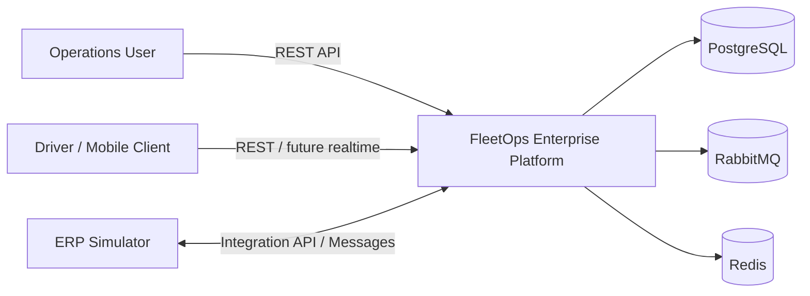

# Architecture Overview

FleetOps starts as a modular monolith with explicit business boundaries. The architecture is intended to demonstrate production-oriented engineering decisions without introducing distributed-system complexity before it is justified.

## System Context



## Initial Modules

| Module | Responsibility |
|---|---|
| `fleetops-common` | Small set of cross-cutting primitives and shared contracts |
| `fleetops-driver` | Driver lifecycle and driver-related business rules |
| `fleetops-vehicle` | Vehicle lifecycle and operational availability |
| `fleetops-trip` | Trip aggregate, assignment, lifecycle, and business invariants |
| `fleetops-integration` | ERP adapters, messaging, reconciliation, and integration contracts |
| `fleetops-bootstrap` | Application composition, runtime configuration, and executable entry point |

## Layering Direction

Business modules will evolve around four conceptual areas:

```text
api -> application -> domain
                   ^
infrastructure ----|
```

The domain layer must not depend on transport, persistence, messaging, or framework-specific implementation details.

## Planned Reliability Patterns

The integration milestone will introduce:

- Transactional outbox
- Consumer inbox / idempotency records
- Retry with bounded backoff
- Dead-letter handling
- Reconciliation jobs
- Correlation IDs
- Explicit error classification

## Architecture Constraints

1. Controllers do not contain business rules.
2. Business modules do not access another module's database tables directly.
3. External ERP details remain behind adapter interfaces.
4. Asynchronous consumers must be idempotent.
5. Database schema changes are versioned through Flyway.
6. Operational concerns must be observable through structured logs, health, and metrics.

## Evolution

Microservices are not a target by default. A module becomes a candidate for extraction only when there is a measurable need for independent deployment, scaling, ownership, availability, or technology choice.
