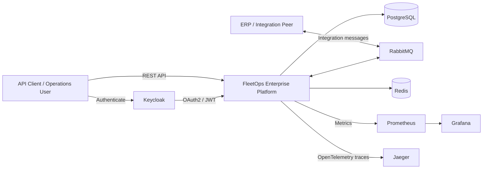
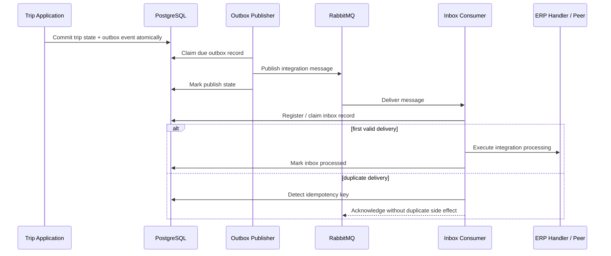
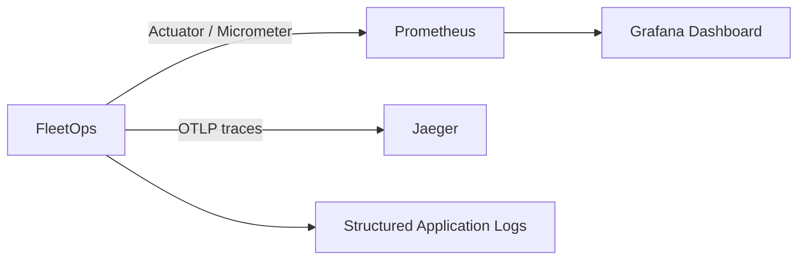

# Architecture Overview

FleetOps is a production-oriented **modular monolith** with explicit business boundaries and infrastructure adapters. The design keeps deployment and local operation simple without giving up the reliability, security, auditability, concurrency controls, and observability expected from enterprise backend systems.

The platform deliberately avoids splitting into microservices without a measurable operational reason. Module boundaries are enforced first; deployment boundaries can change later.

## System Context



## Application Modules

| Module | Responsibility |
| --- | --- |
| `fleetops-common` | Shared technical contracts and provider-neutral concurrency primitives |
| `fleetops-driver` | Driver aggregate, lifecycle, use cases, REST API, and persistence adapters |
| `fleetops-vehicle` | Vehicle aggregate, lifecycle, use cases, REST API, and persistence adapters |
| `fleetops-trip` | Trip aggregate, assignment rules, lifecycle, use cases, REST API, and persistence |
| `fleetops-integration` | ERP integration contracts, transactional outbox/inbox, RabbitMQ adapters, retries, recovery, reconciliation, and operations |
| `fleetops-audit` | Immutable audit domain, persistence, and query contracts |
| `fleetops-bootstrap` | Runtime composition, executable application, security, HTTP audit, integration wiring, and observability |

## Internal Layering

Business modules follow an inward dependency direction:

```text
api -> application -> domain
                   ^
infrastructure ----|
```

The domain layer does not depend on HTTP, persistence, messaging, or framework-specific implementation details. Application services coordinate use cases. Infrastructure adapters implement ports for persistence, messaging, and external integration.

## Reliable ERP Integration

The integration path is designed to avoid dual-write failure modes and duplicate side effects.



Implemented reliability mechanisms include:

- transactional outbox persistence;
- consumer inbox and idempotency keys;
- RabbitMQ publishing and consumption;
- bounded retry/backoff scheduling;
- recoverable outbox/inbox state;
- dead-letter handling and metrics;
- reconciliation and operational recovery APIs;
- correlation-aware audit and tracing.

## Security Boundary

FleetOps runs as an OAuth2 Resource Server. Keycloak provides the local identity provider and issues JWTs. Application roles are intentionally small and explicit:

- `FLEETOPS_USER` — read access;
- `FLEETOPS_OPERATOR` — operational read/write access;
- `FLEETOPS_ADMIN` — administrative and recovery access.

HTTP authorization is enforced centrally in the bootstrap layer while business authorization remains independent of identity-provider-specific role noise. Unknown external roles are not promoted into FleetOps authorities.

See [Security](../security/README.md) for the concrete endpoint policy and [Local Keycloak](../security/keycloak-local.md) for the runnable development setup.

## Audit Architecture

Audit is a first-class module rather than controller logging. The platform records immutable audit events and captures HTTP request context so operational changes can be traced independently of application logs.

The audit design includes:

- immutable audit records;
- actor/action/resource context;
- request correlation metadata;
- HTTP audit capture;
- administrative query access;
- database-backed persistence.

## Concurrency Model

Mutable aggregates use revision-based optimistic concurrency. This prevents silent lost updates when two clients modify the same resource concurrently.

Persistence-specific locking exceptions are translated into provider-neutral application conflicts so API behavior is not coupled to a JPA implementation detail.

## Observability Architecture



The local stack provides:

- readiness and health endpoints;
- Prometheus metrics;
- integration operational metrics;
- provisioned Grafana dashboards;
- OpenTelemetry distributed tracing;
- Jaeger trace exploration;
- CI smoke tests that validate application readiness.

## Runtime Topology

Docker Compose can reproduce the application and its supporting infrastructure locally:

```text
fleetops
├── PostgreSQL
├── RabbitMQ
├── Redis
├── Keycloak
├── Prometheus
├── Grafana
└── Jaeger
```

The FleetOps OCI image runs as non-root UID/GID `10001:10001`. CI validates the container user, Compose topology, and readiness behavior in addition to the Maven verification suite.

## Architecture Constraints

1. Controllers contain transport concerns, not business rules.
2. Business modules do not reach into another module's database tables directly.
3. External ERP details remain behind integration ports/adapters.
4. Asynchronous consumers are idempotent.
5. Business state and outbound integration intent are committed atomically through the outbox pattern.
6. Database schema changes are versioned through Flyway.
7. Mutable aggregate updates use explicit concurrency protection.
8. Security policies are centralized and testable.
9. Audit history is immutable.
10. Operational behavior must be observable through health, metrics, logs, and traces.

## Architecture Decisions

Major engineering choices are documented in [`docs/adr`](../adr/), including:

- modular monolith architecture;
- Java 21 baseline;
- PostgreSQL and Flyway;
- public identifier strategy;
- OAuth2 Resource Server and RBAC;
- immutable audit trail and HTTP audit capture;
- Prometheus and integration operational metrics;
- OpenTelemetry tracing and local observability;
- optimistic concurrency and provider-neutral conflicts;
- hardened OCI packaging;
- Docker Compose application topology.

## Evolution Strategy

Microservices are not an architectural goal by default. A module becomes a candidate for extraction only when there is evidence for independent deployment, scaling, ownership, availability, or technology requirements.

This keeps the current system operationally understandable while preserving boundaries that make future extraction possible without first untangling the domain model.
