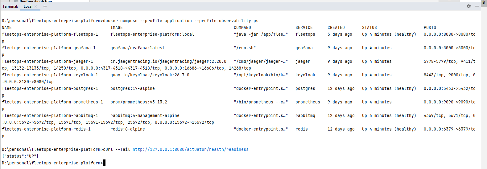
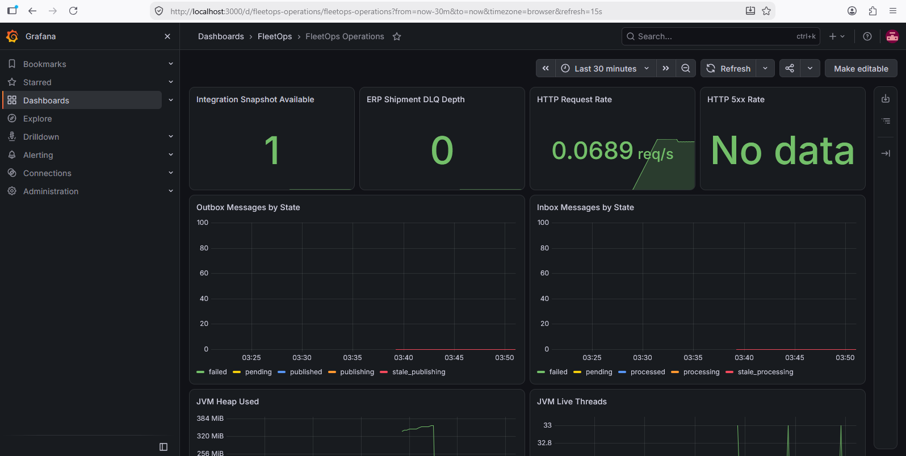
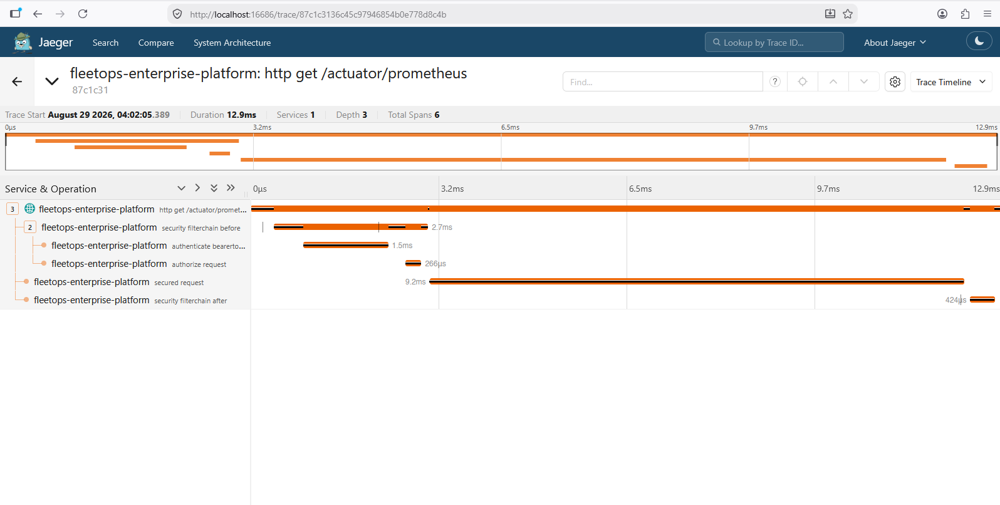
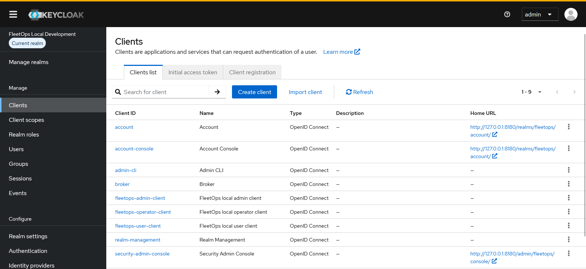
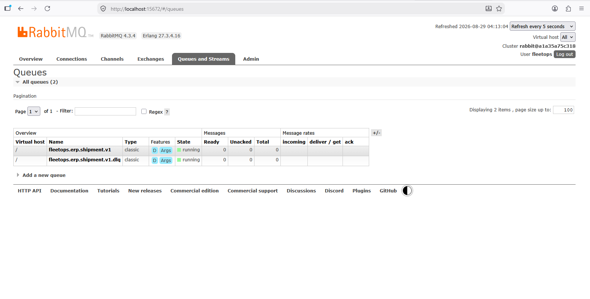
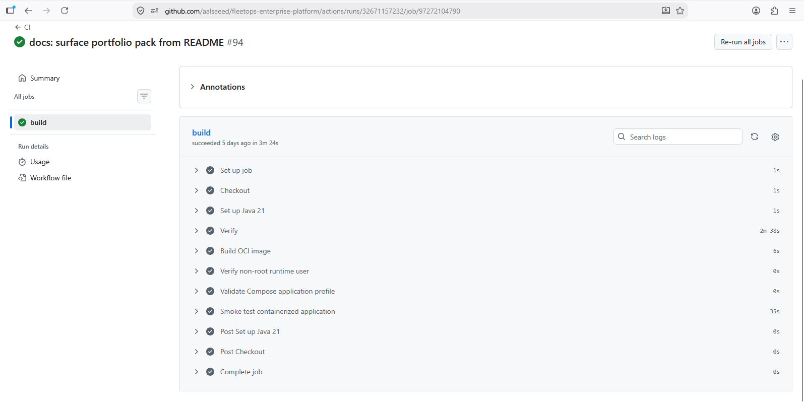

# FleetOps Portfolio Pack

This directory is the shortest path for evaluating FleetOps as an engineering portfolio.

The goal is not to duplicate the technical documentation. It is to connect the implementation, architecture decisions, runtime proof, and presentation material into one review path.

## Recommended Review Path

| Time | Review | What it demonstrates |
| --- | --- | --- |
| 2 minutes | Root `README.md` | Platform positioning, architecture at a glance, implemented capabilities, and runnable stack |
| 5–10 minutes | [Engineering Case Study](CASE-STUDY.md) | Engineering problem, architecture decisions, reliability model, security, audit, observability, and tradeoffs |
| 5 minutes | [Architecture Overview](../architecture/README.md) | Module boundaries, integration flow, runtime topology, and observability design |
| 10 minutes | [Demo Runbook](DEMO-RUNBOOK.md) | Repeatable operational proof using Keycloak, RabbitMQ, Grafana, Jaeger, APIs, and CI |
| Interview / presentation | [Presentation Narrative](PRESENTATION.md) | Seven-slide story for explaining the platform clearly without walking through source code file by file |

## Evidence Principle

Every portfolio claim should be supported by at least one of the following:

1. **Implementation evidence** — source code, configuration, migrations, tests, or ADRs.
2. **Runtime evidence** — a healthy service, API response, metric, trace, queue state, security behavior, or recovery operation.
3. **Automation evidence** — CI verification showing that the behavior is reproducible.

Screenshots are useful only when they prove a distinct capability. They should not be used as decoration.

## Evidence Set

The preferred public evidence set is intentionally small:

1. Full Docker Compose stack healthy.
2. Grafana `FleetOps Operations` dashboard.
3. Jaeger trace crossing an HTTP or message-driven path.
4. Keycloak realm / client / role configuration without secrets.
5. RabbitMQ topology or queue state relevant to the ERP integration flow.
6. Successful GitHub Actions CI run showing verify, OCI hardening, Compose validation, and readiness smoke test.

See [Evidence Asset Guide](assets/README.md) for naming and redaction rules.

## Runtime Evidence Gallery

### 1. Complete Runtime Stack

FleetOps and its supporting PostgreSQL, RabbitMQ, Redis, Keycloak, Prometheus, Grafana, and Jaeger services running together with application readiness confirmed.

### 2. Operational Metrics

Provisioned FleetOps operations dashboard showing integration health, DLQ depth, HTTP activity, messaging state, and JVM runtime metrics.

### 3. Distributed Tracing

OpenTelemetry trace exported from FleetOps to Jaeger, showing request processing across multiple spans.

### 4. Centralized Identity and RBAC

FleetOps Keycloak realm with separate user, operator, and administrator clients demonstrating centralized OAuth2/JWT identity and role separation.

### 5. Asynchronous ERP Integration

ERP shipment queue and dedicated dead-letter queue demonstrating the runtime messaging and failure-handling topology.

### 6. Automated Verification

Successful CI pipeline verifying Maven tests, OCI image construction, non-root execution, Docker Compose configuration, and application readiness.

## What the Portfolio Should Communicate

A reviewer should be able to conclude that FleetOps demonstrates:

- explicit domain boundaries inside a modular monolith;
- reliable asynchronous ERP integration rather than fragile dual writes;
- idempotent processing, retries, recovery, and dead-letter handling;
- OAuth2/JWT authorization with role-based policies;
- immutable auditability and correlation;
- optimistic concurrency protection;
- metrics and distributed tracing designed for production diagnostics;
- hardened, non-root container packaging;
- reproducible local deployment and automated verification.

## Scope Statement

FleetOps is a reference implementation and public engineering portfolio. Its purpose is to demonstrate production-oriented backend and integration engineering decisions, not to present itself as a turnkey commercial fleet-management product.
